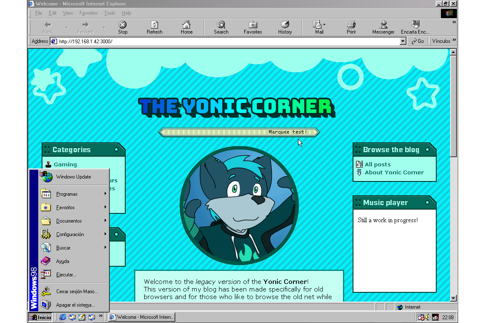

# The Yonic Corner (Legacy edition)

[**Visit the blog here!**](http://yonicdev.github.io/yonic-corner-legacy/)

This is a version of my [personal blog](https://github.com/YonicDev/yonic-corner-astro) designed specifically for late 1990s browsers. It is made with the same framework as the modern blog: Astro.

## Minimal browsers

While Astro outputs HTML5 compliant pages, this blog only elements from up to HTML 4.01, and uses CSS2 alongside with jQuery 1.0 for cross-browser JavaScript. These are the browsers that have been tested to work with all these features:

* **Windows 9x/NT**: Internet Explorer 5.5, Firefox 2, K-Meleon 1.5.4, Opera 9
  * Internet Explorer 5 also works with the blog, but jQuery features will not.
* **Mac OS Classic 9**: Netscape 7, Classilla 9.3.4 Beta

## Differences between Modern and Legacy versions

The content API of both modern and legacy versions is pretty much identical between versions, but there are still some key differences between them, as well as different ways to handle assets:

* **The Legacy version does not include the Svelte integration.** Instead, regular Astro components with jQuery are used when required.
* **Unsupported Astro components** (e.g. `<YouTube>` and `<PlayerLink>`) **will show an information box** with a referral link to the Modern version.
* **The bi(y)onic reading components (`<Paragraph>`, `<ListItem>` and `<Code>`) as well as `<ImageGrid>` are missing** in the Legacy version altogether.
  * The bi(y)onic reading components must be removed from the `export const components` declaration in the MDX files.
  * `<ImageGrid>` must be replaced with a static layout (most often, an HTML table will do).
* **Hero/cover images must have a fixed 3:2 aspect-ratio**. This applies to post and series hero images.
  * This means the `heroPosition` property in the post frontmatter is unused, but the parser still accepts it.
* **Only `jpg`/`jpeg`, `gif` and `png` are eligible formats for the `<Picture>` component**, and defaults to `jpg`. It will error out if the normally accepted by Astro and more modern image formats are used.
  * **Transparent PNG images are not supported**, but won't cause an error when used. Use GIF instead for transparent images.
* **The **`<Picture>`** component has an additional prop: `nocaption`**, a boolean prop that hides the caption box in the picture.
* **`<Chara>` images are GIF only and use their intrinsic size.**
* **Text bubble themes** are defined as separate components that wrap the `<BubbleBase>` component and use a 9-slice GIF image set for the appeareance in the `public/bubbles` folder, in their own folder. Then these are imported and included in the `themes` record in the `TextBubble.astro` component.
* **Music content will only use the first audio source in the `srcset`** field, and **Astro will error out** if the protocol is anything other than plain HTTP *(not HTTPS)*.