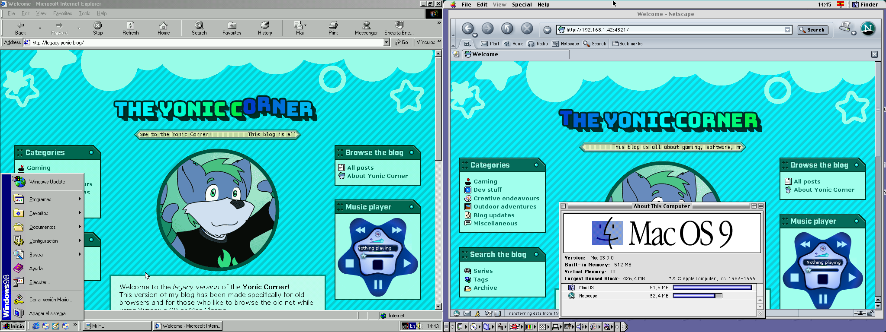

# The Yonic Corner (Legacy edition)

[**Visit the blog here!**](http://legacy.yonic.blog/)

This is a version of my [personal blog](https://github.com/YonicDev/yonic-corner-astro) designed specifically for late 1990s browsers. It is made with the same framework as the modern blog: Astro.

## Migrating from 1.0.0

The process is exactly the same as migrating from the [Modern version's 2.1.0 to 2.2.0](https://github.com/YonicDev/yonic-corner?tab=readme-ov-file#migrating-from-2.1.0).

## Minimal browsers

While Astro outputs HTML5 compliant pages, this blog only renders elements from up to HTML 4.01, and uses CSS2 alongside with jQuery 1.0 for cross-browser JavaScript.

These are the browsers that have been tested to work with all these features:

* **Windows 9x/NT**: Internet Explorer 5.5, Firefox 2, K-Meleon 1.5.4, Opera 9
  * Internet Explorer 5 also works with the blog, but jQuery features will not.
* **Mac OS Classic 9**: Netscape 7, Classilla 9.3.4 Beta

## Differences between Modern and Legacy versions

The content API of both modern and legacy versions is pretty much identical between the two, so you can write a post for both versions in a single MDX file. But there are still some key differences between them, as well as different ways to handle assets:

* **The Legacy version does not include the Svelte integration.** Instead, regular Astro components with jQuery are used when required. Svelte components are automatically ignored from build and should not be rendered in the Legacy version.
* **Posts with `legacy` set to `false`** will be ignored in routing, tag counts, series and RSS feeds. Posts with this field set to `only` will only be taken into account in the Legacy version.
* **Unsupported Astro components** (e.g. `<YouTube>` and `<PlayerLink>`) **will show an information box** with a referral link to the Modern version.
* **Modern-only components will render a warning message** (e.g. `<ImageGrid>`) with a recommendation on what to do to replace them with compatible components or HTML.
  * **Bi(y)onic reading components** (`<Paragraph>`, `<ListItem>` and `<Code>`) **have been deprecated** in 1.2.0 and will be removed in a future version. To migrate to 1.2.0, remove the `exports` statement in all MDX posts.
* **Hero/cover images must have a fixed 3:2 aspect-ratio and named `hero-legacy.png`**. This applies to post and series hero images.
  * Optionally, you may set it in the `hero.legacy` property in the post data. 
  * Like the Modern version, it doesn't necessarily have to be an actual PNG image.
  * The `heroPosition` property in the post frontmatter is left unused, but the parser still considers it as a valid field.
  * The ideal resolution is at 454x303 pixels.
* **The `<Figure>` component will only use its `fallback` field** to determine the format of the image.
  * From 1.2.0, the `nocaption` prop has been removed and does not have any effect. Instead, the caption box is hidden when there are no inner contents in the `<Figure>` component.
* **Transparent PNG images are not supported**, but won't cause an error when used. Use GIF instead for transparent images.
* **`<Chara>` images are GIF only and use their intrinsic size.**
* **Text bubble themes** are defined as separate components that wrap the `<BubbleBase>` component and use a 9-slice GIF image set for the appearance in the `public/bubbles` folder, in their own folder. Then these are imported and included in the `themes` record in the `TextBubble.astro` component.
* **Music content will only use the first HTTP *(not HTTPS)* audio source in the `srcset`** field. If there is none, it will error out.
* **Only the slot `legacy`** in `<VersionBranch>` will be rendered.